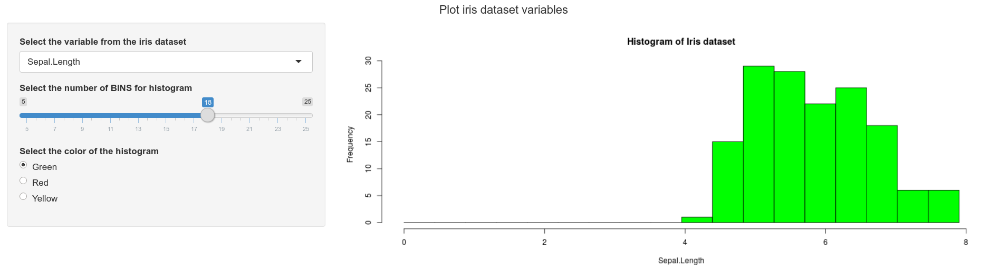
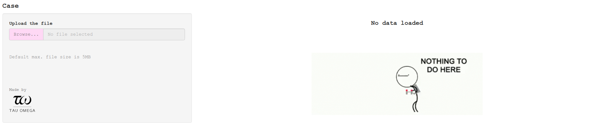

# Documentatie over Shiny Dashboarding

# Inleiding
## Wat is Shiny?
Shiny wordt gebruikt om dashboards te maken vanuit R. Deze dashboards worden uiteindelijk webapps en je kan ze online hosten op https://www.shinyapps.io/ voor een redelijke prijs. Misschien zijn er nog wel andere manieren, maar dit is al erg makkelijk en toegankelijk.  

## Waarom is Shiny interessant voor Tau Omega
We kregen laatst van MomoMedical de vraag voor het visualiseren van data. En uiteindelijk is het voor de klant ook wel fijn om soort van metrics te hebben of de algoritmes die we gebruiken daadwerkelijk wel werken. Dit zouden we kunnen visualiseren in een dashboard gemaakt via Shiny.

## Hoe moet je Shiny gebruiken? (Programmeertaal/software)
Shiny wordt in R geschreven en is niet mogelijk om in notebookvorm te doen (volgensmij). Dus ik raad aan om Rstudio weer op te pakken. Het heeft ook een beetje weg van HTML, dus als je daar een kennis van hebt, dat is wel makkelijker. Het is zeker niet verplicht.

## Doelen
- Volg tutorial [deze](https://www.youtube.com/playlist?list=PL6wLL_RojB5xNOhe2OTSd-DPkMLVY9DfB)
- Maak sicko dashboard voor toekomstige/fictieve klant
- Publiceer dashboard online

# Doel uitwerking
## Doel 1: Volg tutorial
In dit dit stuk zal ik voornamelijk de tutorial in mijn eigen woorden en tempo beschrijven. Hopelijk is alles duidelijk genoeg zodat je de tutorial niet meer hoeft te volgen, maar gewoon dit kan doorlezen in een paar minuten. 

### Code + stap voor stap uitleg
#### Om mee te beginnen
Alle stukken code zijn te vinden op mijn github in [dit project](https://github.com/SimchaGD/Shiny-Tutorial).

Om te beginnen is het belangrijk om te weten hoe de mappenstructuur van een shiny dashboard er uit ziet. Er zijn meerdere mogelijkheden om dit aan te pakken, maar dit is wat ik tot nu toe heb gebruikt. 

```
+- ~/
+-- Dashboard map
|    +-- ui.R
|    +-- server.R
+-----
```

In de map `01 HelloShiny` staat een voorbeeld die de structuur van het dashboard uitlegt. Simpel gezegd heb je aan de linkerkant een menu waar je instellingen kan neerzetten met widgets en aan de rechterkant heb je de output. Hoe dit vormgegeven wordt staat in `ui.R` met als voorbeeld


```R
# load shiny
library(shiny)

shinyUI(
    fluidPage(
        
        titlePanel(title = "Zet hier de titel neer"),
        sidebarLayout( position = "left",
            
            sidebarPanel(h3("Dit is een soort menu"), 
                         h4("Hier komen widgets"),
                         h5("Widget 1"),
                         h5("Widget 2")),
            mainPanel(h1("Hier komt alle output te staan"))
            
        )
    )
)
```

De structuur van het script is altijd hetzelfde, namelijk:


```R
 
library(shiny)
shinyUI(
    fluidPage(
         # UI specificaties
    )
)
```

Dit zal ik niet herhalen in de volgende scripts. 


Alle berekeningen en dergelijke komen in `server.R` te staan. Zo heb je als het ware een scheiding tussen front- en back-end. In `server.R` moet altijd minimaal dit staan. 


```R
# load shiny lib
library(shiny)

shinyServer(
    function(input, output) {
         # hier komen de berekeningen en de verwerkingen in te staan       
    }   
)
```

#### Tekst output
Om mee te beginnen gaan we een app maken die vraagt om je naam en leeftijd en dit als output neerzet op de *main panel*. Hier gebruiken we dan de functies:

- `titlePanel (ui)` --> maakt een titel bovenaan.

    - Input: String

- `sidebarLayout (ui)` --> geeft aan dat je de sidebar layout wil gebruiken

    - Input: Panels
    
- `sidebarPanel (ui)` --> Panel voor het maken van de sidebar

    - Input: Widgets, html tools
    
- `mainPanel (ui)` --> Panel voor het maken van de output pagina

    - Input: html tools, output containers
    
- `textInput (ui)` --> Tekst input container voor het maken van een tekst invulvak

    - Input: String (variabel naam), String (Label), String (standaard waarden)
    
- `textOutput (ui)` --> Tekst output container voor het laten zien van tekst

    - Input: String
    
- `renderText (server)` --> Maakt de tekst voor een output container

    - Input: Functie input (String)
    

In de `fluidPage` komt te staan


```R
# content of dashboard
titlePanel("Tekst input app"),
sidebarLayout(

    sidebarPanel(h3("Enter the personal information"),
                 textInput("name", "Enter your name", ""),
                 textInput("age", "Enter your age", "")
                 ),
    mainPanel(h2("Personal information"),
              textOutput("myName"),
              textOutput("myAge")
              )
)
```

Hier zijn `h3` en `h2` html tools. Door `server.R` even bij het minimale te houden (de functie leef laten) kunnen we wel de app al openen met `ctrl+shift+enter`. 


Aan de buitenkant ziet alles er mooi uit, maar als je in de tekstvakken typt gebeurt er niks. Aan de achterkant moet nog deze koppeling gemaakt worden en dit kan met twee simpele lines code toevoegen aan `server.R`. 


```R
# Render tekst
output$myName <- renderText(input$name)
output$myAge <- renderText(input$age)
```

Door dit stukje code in de functie te zetten zouden de tekstvakken moeten werken. Zorg wel dat de variabelnamen gegeven in `textInput` en `textOutput` hetzelfde zijn (`name`, `age`, `myName`, `myAge`).

Extra features die je hieraan toe zou kunnen voegen zijn de radio buttons, sliders en dropdown menu's. Er veranderd hierdoor niet veel. De syntax van deze features zijn:

- `radioButtons (ui)`

    - Input: variabel naam, Label, choices = list(keuze1, keuze2, keuze3), standaardwaarde (vaak wordt `""` gebruikt)
    
- `sliderInput (ui)`

    - Input: variabel naam, Label, min = minimale waarde, max = maximale waarde, value = standaardwaarde(s) 
    
    - `runExample("05_sliders")` run deze code in R om te zien wat de verschillende mogelijkheden zijn
    
- `selectInput (ui)`

    - Input: variabel naam, Label, keuze (list).
    
    - Dit maakt een dropdown menu.

#### Interactieve Plotjes
Aan tekst alleen heb je natuurlijk niks. Daarom gaan we ook kijken naar het verwerken van plots in onze dashboard. In het dashboard willen we een histogram maken per variabel van de Iris dataset. Met als sidebar opties: dropdown voor het kiezen van een variabel; een slider voor het kiezen van het aantal bins van de histogram en radiobuttons met de kleur van de histogram. We gebruiken 2 nieuwe functies:
- `plotOutput (ui)`

    - Input: variabel naam van gegenereerde plot
    
- `renderPlot (server)`

    - Input: Code voor het genereren van de plot (tussen acculades) 

Om even niet diep te gaan op de code van de sidebar wordt deze hieronder gegeven. Interessanter is hoe de plot gegenereerd wordt. In `renderPlot` (of andere `render...` functies) moet de code die gebruikt wordt om de plot te genereren in acculades geschreven worden. Wat je moet krijgen in binnen het `function`-blok is alleen maar variabel toekennen door `render`-functies. Binnen de `render`-functies komt de code te staan als `if`-statements en dataselectie. Voor deze plot krijg je dus de volgende stuk code:


```R
function(input, output){
    # determine output
    output$IrisHist <- renderPlot({
        colm <- as.numeric(input$var)
        data = iris[, colm]

        hist(data, breaks = seq(0, max(data), l = input$bins + 1), col = input$colour,
             main = "Histogram of Iris dataset", xlab = names(iris[colm]))
    })
}
```


```R
sidebarPanel(
    selectInput("var", "Select the variable from the iris dataset",
                choices = c("Sepal.Length" = 1, "Sepal.Width" = 2, "Petal.Length" = 3,
                            "Petal.Width" = 4), selected = 1),
    sliderInput("bins", "Select the number of BINS for histogram", 
                min = 5, max = 25, value = 15),
    radioButtons("colour", "Select the color of the histogram", 
                choices = c("Green", "Red", "Yellow"), selected = "Green")
)
```



Wil je dat de plot niet automatisch geüpdate wordt, dan moet je een submit knop in de sidebar panel toevoegen. Dit is maar 1 regel code, namelijk
```R
submitButton("Update")
```
Dit zorgt ervoor dat de plot niet interacteert, maar dat je eerst al je instellingen kan kiezen voordat je het ziet.

#### Tabladen
In een dashboard met een plot ben je niet erg flexibel met wat je kan laten zien. Je wil vaak meer informatie op een dashboard hebben en dat kan makkelijk met tabladen. We gaan drie tabladen toevoegen aan de plot:

- Een five number summary

- De structuur van de dataset

- De dataset

- Plot

Daarnaast gaan we gebruik maken van nieuwe opmaak methodes. Deze nieuwe functies gaan we gebruiken:

- `tabsetPanel (ui)` --> maakt format voor tabladen

    - Input: type ("tabs" of "pills"
    
- `tabPanel (ui)` --> maakt tablad
    
    - Input: Label op tablad, outputFunctie
    
- `verbatimTextOutput (ui)` --> OutputFunctie die geformateerde tekst letterlijk neerzet
    
    - Input: variabel naam

- `tableOutput (ui)` --> OutputFunctie die tabel maakt

    - Input: variabel naam

- `renderPrint (server)` --> genereerd tekst met behoudende format

    - Input: Geformateerde tekst

- `renderTable (server)` --> genereerd tabel

    - Input: tabel

Aan de `sidebarPanel` veranderd niks. In de `mainPanel` staat het volgende:


```R
mainPanel(
    tabsetPanel(
        type = "tabs",
        tabPanel("Summary", verbatimTextOutput("summary")),
        tabPanel("Structure", verbatimTextOutput("struct")),
        tabPanel("Data", tableOutput("IrisData")),
        tabPanel("Plot", plotOutput("IrisHist"))
    )
)
```

De code voor de summary en structure zijn redelijk voorzichzelf sprekend:


```R
#determine five number summary
output$summary <- renderPrint(summary(iris))

# determine strucure of dataset
output$struct <- renderPrint(str(iris))
```

We willen dat de formatering van deze twee outputs hetzelfde blijfd. Vandaar dat we `verbatim` en `renderPrint` gebruiken. De code voor de tabel:


```R
# determine datatable visualisation
output$IrisData <- renderTable({
    colm <- as.numeric(input$var)
    iris[colm]

}, bordered = TRUE, rownames = TRUE)
```

De output (`iris[colm]`) wordt als tabelformat gegenereerd. De opmaak kan je nog veranderen met foefjes zoals omlijning, rijnummers of spacing. 

De plot code veranderd niet t.o.v. de vorige plot.


#### Reactive functions
We zien dat we dezelfde code hebben gebruikt bij het plotten als bij het formateren van de tabel (bij het definieren van `colm`). Dit zou natuurlijk efficienter kunnen als we deze code vooraf definieren en kunnen gebruiken in beide blokken code. Dit kan met `reactive`. Het is een beetje een yankee oplossing, maar het werkt wel. 

Voor het genereren van de plot of tabel zetten we de volgende code:


```R
# make reactive function to reuse this variable
colm <- reactive({
    as.numeric(input$var)
})
```

Dit betekend dat colm nu een functie is die `as.numeric(input$var)` returned. Dit wil ook zeggen dat je `colm` nu moet gaan gebruiken als een functie, dat wil zeggend, verander elke `colm` in je code naar `colm()`.

#### Download plot knop
Je kan de mogelijkheid toevoegen dat de gebruiker de plot download. Dan zou dit het resultaat zijn


Je hebt een plot die je kan downloaden via de download knop. De plot kan van alles zijn, dus het maken van de plot wordt niet behandeld. De twee functies die we gebruiken is

- `downloadButton (ui)`
    - Input: variabel naam, label (tekst op de knop)
    
- `downloadHandler (server)`
    - Input: filename (function), content (function)
    
In de `mainPanel (ui)` moet je de line `downloadButton("download", label = "Download iris plot")` toevoegen. Voor `server` is het iets ingewikkelder. Je begint met de volgende code als skelet:


```R
# create download handler
output$download <- downloadHandler(
    # Specify filename
    filename = function() {
    },
    # Specify Content
    content = function(file) {
    }
)
```

In deze twee functies ga je definieren wat de standaard filename is en wat de inhoud is. Beide zijn afhankelijk van het formaat waarin de plot opgeslagen moet worden. Voor de filename wil je dat de plot opgeslagen als "iris.png" als de keuze een png is, maar ook als "iris.pdf" als de gebruiker kiest dat het een pdf moet zijn. Dit is relatief simpel aangezien we de keuze van de radioButtons kunnen gebruiken. Daardoor krijgen we de volgende code:


```R
filename = function() {            
    paste("iris", tolower(input$format), sep = ".")
},
```

Bij het opslaan van files moeten we eerst een *device* openen. Ik ga hier niet te diep op in, maar dit heeft vooral te maken met het lezen en uitschrijven van bijvoorbeeld plaatjes of andere documenten. Daarna moet je de plot maken en vervolgens het *device* uitzetten. Dit leidt tot de volgende code:


```R
# Specify Content
content = function(file) {
    # Decide which device to open
    if (input$format == "PNG"){
        png(file)
    }
    else {
        pdf(file)
    }
    # Create plot
    plot(x, y) # genereer hier je eigen plot. 
    
    # Close device
    dev.off()
}
```

#### Download tabel
Stel je wil een dashboard maken waarin je de data die gebruikt wordt kan downloaden. Dit kan bijna netzo makkelijk als het downloaden van een plot. Het resultaat waar je naar toe moet werken:


De basis dingen ga ik hier niet behandelen, het is namelijk erg basic en bevat geen nieuwe functies. Wat ik wel gebruik is `switch-case` statements voor het vergelijken met strings. NOTE: voor het uitschrijven naar excel is wel handig om de writexl library te hebben.

Er zijn 2 inputs, dus 2 dingen die je moet checken:

- Welke dataset is het?

- Naar welk format moet ik uitschrijven?

Beide doe ik met de volgende `switch-case` statements:


```R
# Decide fileSep
fileSep <- switch(
    input$format, 
    "Excel" = ",",
    "CSV" = ";",
    "TXT" = "\t"
)
# Choose table for download
data <- switch(
    input$dataset, 
   "iris" = iris,
   "mtcars" = mtcars,
   "trees" = trees)
```

Omdat csv en txt plain-text bestanden zijn en excel niet, kan je die niet op dezelfde manier uitschrijven. Daar moet ondercheid gemaakt worden met een string compare (library: `stringi`). Vervolgens is het uitschrijven zoals je altijd hebt uitgeschreven. 


```R
# Different method to write out a table to excel than csv/txt
if (stri_cmp_eq(input$format,"Excel")){
    write_xlsx(data, file)
}else{
    write.table(data, file, sep = fileSep, row.names = FALSE)
}  
```

#### Reactive UI
Met reactive UI kan je afhankelijk van andere UI variabelen widgets selecteren. Bijvoorbeeld: je hebt verschillende datasets die je wil bekijken en afhankelijk van de dataset maak je de variabele waar je uit kan kiezen om te plotten. Zie hier het voorbeeld.


Er zijn maar twee nieuwe functies nodig om dit te maken:

- `uiOutput (ui)`
    
    - Input: variabel naam
    
- `renderUI (server)`

    - Input: UI input (zoals `selectInput`, `radioButtons`)
    
De code is relatief simpel. Voornamelijk `server.r` veranderd, want binnen `ui.r` veranderd alleen de sidebar pannel. 


```R
# ui.r
sidebarPanel(
    selectInput("dataset", "Select the dataset",
                choices = list("iris", "mtcars", "trees"), 
                selected = 1),
    br(),
    uiOutput("vx"),
    uiOutput("vy")
)
```


```R
# server.r
# determine variable names
cNames <- reactive({
    # Use switch-case
    switch(input$dataset, 
           "iris" = names(iris),
           "mtcars" = names(mtcars),
           "trees" = names(trees)
    )
})

# Determine what UI should change 
output$vx <- renderUI({
    selectInput("variableX", "Select X variable", choices = cNames())
})
output$vy <- renderUI({
    selectInput("variableY", "Select Y variable", choices = cNames())
})
```

De `selectInput` is nu afhankelijk van iets anders dat in `server.r` gebeurt. Misschien had dit ook zonder renderUI kunnen doen, maar bij het volgende voorbeeld kan je er echt niet omheen.

#### File input
Het is altijd handig dat de gebruiker een bestand kan uploaden. Bij shiny moeten we met twee dingen rekening houden: Wat is de output voordat de file is geupload en wat is de output erna? Doordat de UI nu dynamisch moet zijn, gaan we weer gebruik maken van renderUI. 


Bij `ui.r` is er niks complex of raars aan de hand. Wat er gedaan moet worden is: `fileInput` box neerzetten en een paar opties voor het inlezen van het bestand (headers en separators). In de `mainPanel` komt `uiOutput` te staan omdat de gehele output afhankelijk is van de gebruiker.


```R
sidebarPanel(
    fileInput("file", "Upload the file"),
    helpText("Default max. file size is 5MB"),
    br(),
    h5("Select the read.table parameters below"),
    checkboxInput(inputId = "header", label = "Header", value = FALSE),
    br(),
    radioButtons("sep", label = "Separator", 
                 choices = c(Comma = ",", 
                             Semicolon = ";",
                             Tab = "\t",
                             Space = " "))
),
mainPanel(
    uiOutput("tb")
)
```

Als het goed is moet je nu wel kunnen snappen/raden hoe de syntax werkt, dus dit zal niet al te moeilijk zijn om te begrijpen hoe `fileInput` en `checkboxInput` werkt. 

`server.r` begint eerst met wat setups voor het grotere geheel. Bij elk van deze variabele moet er gecheckt worden of de file al beschikbaar is. Als dat niet zo is, dan moeten ze niks doen (`return()`). Verder zijn het maar standaard dingen.


```R
data <- reactive({
    file1 <- input$file
    if (is.null(file1)){return()}
    read.table(file = file1$datapath, 
               sep = input$sep, header = input$header)
})

output$filedf <- renderTable({
    if (is.null(data())){return()}
    input$file
})

output$summary <- renderPrint({
    if(is.null(data())){return()}
    summary(data())
})

output$table <- renderTable({
    if(is.null(data())){return()}
    head(data(), n = 10)
})
```

Bij het maken van de UI moet weer gecheckt worden of er al data is (misschien had ik een aparte variabel kunnen maken hiervoor) om verschillende outputs weer te geven. Dit maakt het dynamisch. Is er nog geen data, dan staat er *Powered by Tau Omega*. Als er wel data is, komen er 3 tabladen tevoorschijn met elk hun eigen inhoud. Om externe files te gebruiken moet je een map in de working directory maken met de naam _www_. Daar kan je files als afbeeldingen, csv of css-sheets opslaan.


```R
output$tb <- renderUI({
    if(is.null(data())){
        h5("Powered by", tags$img(src = "TW_logo.png", 
                                  height = 200, width = 200))
    }
    else{
        tabsetPanel(
            tabPanel("Data preview", 
                     tableOutput("table")),
            tabPanel("Summary", 
                     verbatimTextOutput("summary")),
            tabPanel("meta", 
                     tableOutput("filedf"))
        )
    }

})
```

#### Sidebar afhankelijk van tablad maken
Hiervoor gebruiken we de functie `conditionalPanel()` gebruiken samen met de tablad `ID` koppeling. Om dit praktisch te maken heb ik een kleine case gemaakt. Het idee is dat je aan het begin maar 1 optie hebt:



Die optie is een file uploaden (of naar de Tau Omega pagina gaan). Daarnaast is alles in de Tau Omega huisstyle en staat er een leuke gif. 

Wanneer èèn file wordt geüpload, komen de tabladen tevoorschijn. Navigeer naar het tweede tablad en dan verschijnen de opties voor `read.table`. Als je deze aanpast, blijf je op het tweede tablad staan.

 

Als je twee files upload, dan moet er eerst gekozen worden welke file je wil previewen. Je wordt direct omgeleid naar het tweede tablad en de keuze welke file je wil kiezen als preview is als dropdown functie erbij gekomen. 


Laten we beginnen met een conditionalPanel maken. Dit is een sidebar panel die afhankelijk is van de rest van de gui. De opzet van `conditionalPanels` is het volgende

```R
sidebarLayout(
    sidebarPanel(
        theme = "style.css",
        titlePanel(title = "Case"),
        
        conditionalPanel1
        
        conditionalPanel2

        conditionalPanel3
        
        conditionalPanel4
    ),
    mainPanel(align = "center",
        uiOutput("tb")
    )
)
```
De eerste conditionalPanel is de file input, maar ondanks het een conditionalPanel is moet deze altijd blijven staan. De file input moet namelijk altijd aanwezig zijn. Dit stukje code gaat als volgt:


```R
conditionalPanel(
    "true",
    fileInput("file", "Upload the file", multiple = TRUE),
    helpText("Default max. file size is 5MB")
),
```

Het eerste argument is een (java script based) condition die bepaald of de panel zichtbaar is of niet. Vervolgens is het objecten toevoegen zoals je bij normale sidebarPanels ook zou doen. Het java script based condition is snel op te pakken als je het nog niet kent. 

De volgende 

### Voorbeeld voor binnen Tau Omega

### Eventuele aanschaffing van software/hardware


### Bronnen

# Doel uitwerking
## Doel 2
### Code + stap voor stap uitleg

### Bronnen

### Voorbeeld voor binnen Tau Omega

### Eventuele aanschaffing van software/hardware


# Slot
## Is het bruikbaar/nuttig

## Nieuwe dingen de je bent tegengekomen die onderzocht moeten worden


# Maak een presentatie
- Workshop of Presentatie?
- Presenteren op: 

## Vergeet niet je document naar pdf te exporteren en in de dropbox map te zetten
